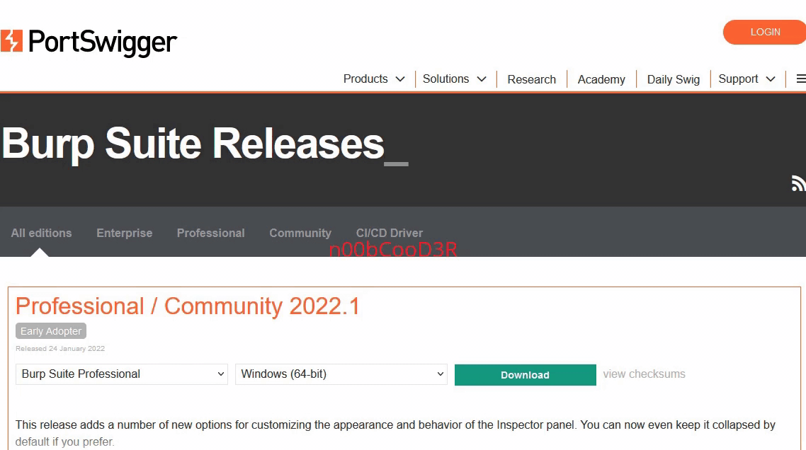

# Crack burp Manually in linux

<h2>Download Official burp proffessional from portswigger site OR </h2>
 

  <h3><a href="https://portswigger.net/burp/releases">🇨​🇱​🇮​🇨​🇰​ 🇭​🇪​🇷​🇪​</a>
  </h3>
     
  <h2>Download the same <code>Burp Suite proffesional</code> and extension should be <code>.Jar</code> file</h2>
  </img>
   
  <h2>STEP-1. After downloading burp-pro Clone this repo</h2>
   
  <h3>Type in terminal <code> git clone https://github.com/n00bcooD3R/burp-pro.git</code></h3>
   
  <h2>STEP-2. You will get a folder called <code>burp-pro</code> get into that folder . You will see two files called
 
  <code>keygen.jar</code>
 
  <code>loader.jar</code>
</h2>
 
<h2>STEP-3. Create a Folder named <code>burp</code> in desktop and Move both <code>keygen.jar</code> and <code>loader.jar</code> files into that folder using <code>mv</code> command</h2>
 
<h2>STEP-4. After that type in this command
  <h3><code>java --illegal-access=permit -Dfile.encoding=utf-8 -javaagent:/home/kali/Desktop/burp/loader.jar -noverify -jar /home/kali/Desktop/burp/burpsuite_pro_v2022.1.jar &</code>
  </h3>
   NOTE:type in correct location (path) of the file while using above command</h2>
   
  <h2> Your burpsuite will open up it will take time depending on your pc specs , While its loading Open new terminal and Go to <code>desktop/burp</code> the Folder which we have created earlier and type in this Command
   
  <h3><code>java -jar keygen.jar</code></h3>
   
  <h2>STEP-5. The loader file will open up</h2> <h3>
  ⅰ. Modify License String like "license to YourName" 
	ⅱ. Copy License key from keygen.jar and paste in Burp Suite Pro and click Next. 
	ⅲ. Select Manual Activation Option on your bottom Right in Burp Suite Pro. 
	ⅳ. Copy License Request from BurpSuite_Pro and paste in keygen.jar 
	ⅴ. Copy license response from keygen.jar and paste in BurpSuite_Pro, and next and Done 
    </h3><h2>HEHE its Cracked 
  </h2>
   
  <h2>How to automate These Steps</h2> 
  <h3>
    ⅰ. With Sudo Permissions, Create a file with command "gedit /bin/burp" 
	ⅱ. Paste command in text editor "java --illegal-access=permit -Dfile.encoding=utf-8 -javaagent:/home/kali/Desktop/burp/loader.jar -noverify -jar /home/kali/Desktop/burp/burpsuite_pro_v2022.1.jar &" 
	ⅲ. Change Permissions for files with command "chmod +x /bin/burp"
  </h3>
  <h2>Last not least How to execute or open Burp After This Step</h2>
  <h1>Just simply Write burp in Terminal and press Enter<h1>
    <h1> hehe ENJOY</h1>
    
    
